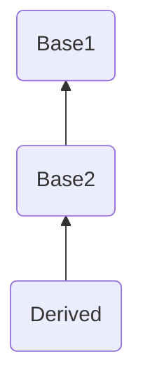
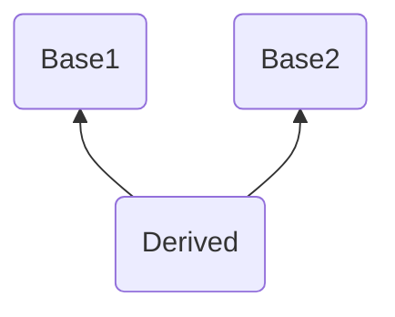
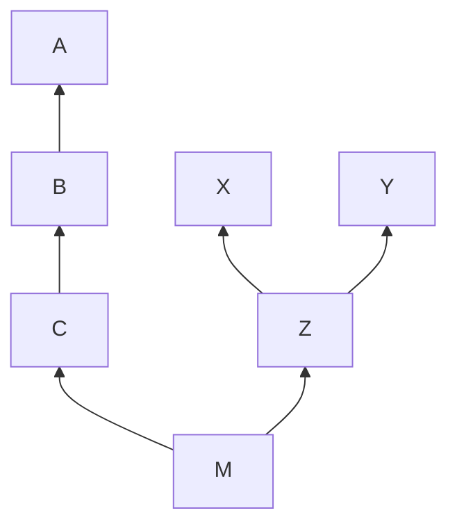
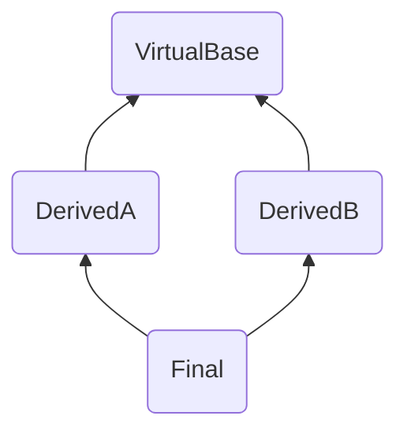

## OOP 复习笔记

### 更新说明：
0. 2025-07-09 00:00 创建文档
1. 2025-07-09 0:30 完成至第3章
2. 2025-07-09 11:50 完成至第5章
3. 2025-07-10 1:00 完成至第7章
4. 2025-07-10 21:00 全部完成
---

### 1. 绪论

> 面向对象编程（OOP）是一种编程范式，它使用“对象”来设计软件和程序。OOP的主要目标是提高代码的可重用性、可维护性和可扩展性。<br/><br/>
OOP的基本概念包括类（Class）、对象（Object）、属性（Attribute）、方法（Method）、继承（Inheritance）、多态（Polymorphism）和封装（Encapsulation）。

### 2. C++语言简单程序设计

- 新的初始化方法

```cpp
int a = {1}; // C++11
int b(1); // C++98
```

- 新的注释语句

```cpp
// 单行注释

/*
多行注释
*/
```

- 新的数据类型

```cpp
bool a = true; // 布尔类型
```

- 随用随定义

```cpp
/*
    变量不一定在程序开始就定义，而是在需要时才进行。
*/

int x,y;

x = 1;
y = 2;

int sum;   // 需要用到变量存储x和y的和，才定义sum

sum = x+y;
```

- string类的使用（仅举例考试可能会遇到的）

```cpp
string str;
string str1 = "hello";
string str2 = "world";
string str3 = str1 + str2; // 字符串连接
cin >> str; // 输入字符串
cout << str3 << endl; // 输出字符串
```

```cpp
string str;
getline(cin, str); // 从键盘输入一个字符串（包括空格）存储到str中，默认以回车键为终止符。
```

```cpp
string str;
getline(cin, str, ","); // 从键盘输入一个字符串（包括空格）存储到str中，以半角逗号为终止符。
```

- 顺序、选择和循环等基本控制结构

```cpp
// 顺序结构
int a = 1;
int b = 2;
int c = a + b;

// 选择结构
if (a > b) {
    cout << "a > b" << endl;
} else {
    cout << "a <= b" << endl;
}

// 循环结构
for (int i = 0; i < 10; i++) {
    cout << i << endl;
}
```

- using namespace std名字空间

```cpp
using namespace std; // 使用标准命名空间
int main() {
    int a;
    cin >> a;
    cout << a << endl;
    return 0;
}
```

```cpp
// 不使用标准命名空间
int main() {
    int a;
    std::cin >> a;
    std::cout << a << endl;
    return 0;
}
```

```cpp
using std::cin, std::cout; // 单个对象使用前声明
int main() {
    int a;
    cin >> a;
    cout << a << endl;
    return 0;
}
```

- iostream头文件

```cpp
// #include <stdio.h>
#include <iostream> // 包含标准输入输出流头文件
```

- 输入输出（cin/cout）

```cpp
int a;
cin >> a; // 从键盘输入一个整数存储到a中
cout << a << endl; // 输出a的值
```

### 3. 函数

- 函数的原型声明、定义和使用

```cpp
// 函数原型声明
int add(int a, int b);

// 函数定义
int add(int a, int b) {
    return a + b;
}

// 函数调用
int a = 1;
int b = 2;
int c = add(a, b);
```

- 内联函数

```cpp
/*
    inline: 内联函数显式声明时所用关键字。

    一般来说，函数调用会降低执行效率。有很多的现场、返回地址需要保存，参数地址需要分配。

    对于结构简单、语句较少的函数可以在函数定义时加inline关键字修饰，做成内联函数，类似宏替换。

    内联函数在被调用时不发生控制转移，而是将函数体嵌入到调用处。
*/

// 内联函数定义
inline int add(int a, int b) {
    return a + b;
}

// 函数调用
int a = 1;
int b = 2;
int c = add(a, b); // 等效于 -> int c = a + b;
```

- 带默认形参值的函数

```cpp
/*
    函数在定义时可以预先声明默认的形参值。
    如：
*/

// 默认形参值必须从右向左顺序声明。
int add(int x, int y, int z);

int add(int x, int y, int z=0);

int add(int x, int y=0, int z=0);

int add(int x=0, int y=0, int z=0);
```

- 函数重载

```cpp
/*
    C++允许语义和功能相近的函数在相同的作用域内以相同函数名声明，从而形成重载（overloading）。

    重载函数的形参必须不同：形参类型不同或个数不同。

    不以形参名来区分，不以返回值类型来区分。
*/

// 以此函数为基准
int add(int a, int b) {
    return a + b;
}

// overload 形参类型不同
double add(double a, double b) {
    return a + b;
}

// overload 形参个数不同
int add(int a, int b, int c) {
    return a + b + c;
}

// overload 类型不同
const int add(int a, int b, int c) {
    return a + b + c;
}
```

- 引用做形参

```cpp
/*
    引用(&)： 特殊类型的变量，是标识符的别名。

    用引用做形参，实现地址的传递，还可以避免值传递带来的开销。
*/

// 引用做形参
void swap(int &a, int &b) {
    int temp = a;
    a = b;
    b = temp;
}

// 函数调用
int a = 1;
int b = 2;
swap(a, b);
```

- ~~函数模板~~

```cpp
/*
    函数模板是对函数的一种抽象，它不是具体的函数，而是一种函数的抽象描述。
    函数模板可以用来生成多个函数。

    函数模板的定义格式：
    template <typename T>
    返回类型 函数名(形参列表) {
        函数体
    }
*/

// 函数模板定义
template <typename T>
T add(T a, T b) {
    return a + b;
}

// 函数模板调用
int a = 1;
int b = 2;
int c = add(a, b);

double x = 1.1;
double y = 2.2;
double z = add(x, y);
```

### 4. 类与对象
- OOP的特征：抽象，封装，继承，多态

    - 抽象

        ```cpp
        class Clock {
        public:
            void setTime(int newH, int newM, int newS);
            void showTime();
        private:
            int hour, minute, second; // 把特征抽象出来
        };
        ```

    - 封装

        ```cpp
        // 封装成时钟类，方便调用
        class Clock {
        public:
            void setTime(int newH, int newM, int newS);
            void showTime();
        private:
            int hour, minute, second;
        };
        ```

    - 继承

        ```cpp
        // 继承时钟类，创建一个电子时钟类
        class DigitalClock : public Clock {
        public:
            void showTime();
        };
        ```

    - 多态

        ```cpp
        /*
            多态的类型：

            1. 重载多态 函数重载/运算符重载
            2. 强制多态 类型强制转换
            3. 包含多态 虚函数--唯一的动态绑定
            4. 参数多态 函数模板/类模板

            多态的实现：
                编译：静态绑定
                运行：动态绑定

            具体见第8章。
        */
        ```

- 构造函数与析构函数

```cpp
/*
    constructor
    在对象创建时进行初始化工作，由系统自动调用。

    destructor
    用来完成对象被删除前的一些清理工作，是对象生存期即将结束时被自动调用的。
*/
class Clock {
public:
    // Clock类的带参数的构造函数
    Clock(int newH, int newM, int newS) : hour(newH), minute(newM), second(newS) {}

    // Clock类的默认构造函数
    // 编译器只有在没有显式定义构造函数时，才会自动生成默认构造函数（隐式）
    Clock() : hour(0), minute(0), second(0) {}

    Clock(); // 默认构造函数
    ~Clock(); // 析构函数，不带任何参数

    void setTime(int newH, int newM, int newS) {
        hour = newH;
        minute = newM;
        second = newS;
    }
    void showTime() {
        cout << hour << ":"<< minute << ":"<< second << endl;
    }
private:
    int hour, minute, second;
};

// 类外实现构造函数
Clock::Clock() : hour(0), minute(0), second(0) {}

// 类外实现析构函数
Clock::~Clock() {
    // dosomething
}

```

- 复制构造函数

```cpp
/*
    copy constructor
    特殊的构造函数，其形参是本类对象的引用。
    把初始值对象的每个数据成员的值都复制到新建立的对象中。
    如果没有定义复制构造函数，编译器会自动生成一个默认的复制构造函数。

    浅拷贝是指简单的复制一个对象的成员变量的值到另一个对象，如果成员变量包含指针，那么两个对象的指针将指向同一块内存。
    相反，深拷贝不仅复制对象的值，还为指向的数据分配新的内存空间，确保每个对象拥有独立的副本。
*/

class Point {
public:
    Point(int x = 0, int y = 0) : x(x), y(y) {}
    Point(const Point &p) : x(p.x), y(p.y) {} // 深复制，需要自己实现复制构造函数
    ~Point() {}
private:
    int x, y;
};

void fun(Point p){
    cout << p.x << "," << p.y << endl;
}

Point func(){
    Point p(1, 2);
    return p;
}

// 以下三种情况会调用复制构造函数
int main() {
    Point a(1, 2);

    // 类对象初始化类对象
    Point b = a;
    Point c(a);

    // 类对象作为函数参数
    fun(a);

    // 类对象作为函数返回值
    Point d = func();

    return 0;
}
```

- 类的组合

```cpp
/*
    类内嵌其他类对象作为成员的情况，它们之间的关系是包含和被包含的关系。
    内嵌对象的初始化在初始化列表中进行。
*/

class Date {
public:
    Date(int y, int m, int d) : year(y), month(m), day(d) {}
    void show() {
        cout << year << "-" << month << "-" << day << endl;
    }
private:
    int year, month, day;
};

class Student {
public:
    Student(int n, string name, Date d) : num(n), name(name), birth(d) {}
    void show() {
        cout << num << " " << name << " ";
        birth.show();
    }
private:
    int num;
    string name;
    Date birth;
};

int main() {
    Date d(2022, 10, 1);
    Student s(1, "Tom", d);
    s.show();
    return 0;
}
```

### 5. 数据的共享与保护

- 作用域与可见性

```cpp
/*
    作用域：函数原型作用域，局部作用域，类作用域，命名空间作用域
*/
```

```cpp
// 函数原型作用域
// a, b 作用范围即为函数原型作用域，仅在括号和大括号中可以使用
int fun(int a, int b){
    return a + b;
};
```

```cpp
// 局部作用域
// a, b, c 作用范围即为局部作用域，仅在函数体内可以使用
int fun(int a, int b){
    int c = a + b; // a, b, c 又称局部变量
    return c;
};
```

```cpp
// 类作用域
// x, y, z 作用范围即为类作用域，可以在类内使用
class A {
public:
    int x;
private:
    int y;
protected:
    int z;
};
```

```cpp
// 命名空间作用域
// a, b 作用范围即为命名空间作用域，可以在命名空间内使用
namespace my_namespace {
    int a = 1;
    int b = 2;
}

int main() {
    cout << my_namespace::a << " " << my_namespace::b << endl;
    // 或者使用 using namespace my_namespace;
    return 0;
}
```

```cpp
/*
    可见性：public, private, protected
*/

class A {
public:
    int x; // public 公共可见，可以在类外访问
private:
    int y; // private 私有可见，只能在类内访问
protected:
    int z; // protected 保护可见，只能在类内和派生类中访问
};
```

- 对象生存期
    - 静态生存期

    ```cpp
    /*
        如果对象的生存期与程序的运行期相同，则称该对象具有静态生存期

        全局变量、静态变量、静态常量、静态函数、静态成员函数、静态成员变量等。
        （以 static 关键字修饰的一般都是）
    */
    int a = 1; // 全局变量
    const static int c = 3; // 静态常量

    void func() {
        static int b = 2; // 静态变量
        b++; // 每次调用 func 函数时，b 的值都会保留下来
        cout << b << endl; // 输出 2, 3, 4, 5, ...而不是 2, 2, 2, 2 , ...
    }

    static void fun() { // 静态函数
        cout << "static function" << endl;
    }

    class A {
    public:
        static int x; // 静态成员变量
        static void fun() { // 静态成员函数
            cout << "static member function" << endl;
        }
    };
    ```

    - 动态生存期

    ```cpp
    /*
        如果对象的生存期与程序的运行期不同，则称该对象具有动态生存期

        局部变量、动态变量、动态常量、动态函数、动态成员函数、动态成员变量等。
    */

    void func() { // 每次调用都是一个新的函数，所以是动态函数
        int a = 1; // 局部变量
        int* b = new int(2); // 动态变量
        const int c = 3; // 动态常量
        delete b; // 动态变量需要手动释放内存
    }

    class A {
    public:
        int x; // 动态成员变量
        void fun() { // 动态成员函数
            cout << "dynamic member function" << endl;
        }
    }
    ```

- 静态成员

```cpp
/*
    静态数据成员，用 static 关键字声明。

    该类的所有对象维护该成员的同一个拷贝。
    必须在类外赋值，用(::)来指明所属的类。

    静态函数成员

    静态函数成员可以直接访问属于该类的静态成员。
    类外代码可以调用公有的静态函数成员，通过类名或对象名来调用均可。
*/

class BankAccount {
public:
    BankAccount(double b) : balance(b) {
        totalAccounts++;
        totalBalance += b;
    }

    ~BankAccount() {
        totalAccounts--;
        totalBalance -= balance;
    }

    static void showTotals() {
        cout << "Total accounts: " << totalAccounts
            << ", Total balance: " << totalBalance << endl;
    }

private:
    double balance;
    static int totalAccounts;   // 静态数据成员
    static double totalBalance; // 静态数据成员
};

// 静态成员初始化
int BankAccount::totalAccounts = 0;
double BankAccount::totalBalance = 0.0;

int main() {
    BankAccount a1(1000), a2(2500);
    a1.showTotals(); // 通过对象访问
    BankAccount::showTotals(); // 通过类名访问，直接调用，不创建对象
    {
        BankAccount a3(5000);
        BankAccount::showTotals();
    }
    BankAccount::showTotals();
}
```

- 共享数据的保护

```cpp
class Circle {
public:
    Circle(double r) : radius(r) {}

    // const成员函数：保证不修改对象状态
    double area() const {
        return PI * radius * radius;
    }

    // const参数：保护传入数据
    bool isLargerThan(const Circle& other) const {
        return radius > other.radius;
    }

private:
    const double PI = 3.14159; // const成员
    double radius;
};

int main() {
    const Circle c(5.0); // const对象
    cout << "Area: " << c.area() << endl; // 只能调用const成员函数
}
```

- 友元

```cpp
/*
    由关键字friend修饰的非成员函数，能够通过对象名访问 private 和 protected成员。增加灵活性，使程序员可以在封装和快速性方面做合理选择。

    1. 友元关系是单向的。

    2. 友元关系不可以传递。

    3. 友元关系不可以继承。
*/
class Circle {
    friend class Rectangle; // 声明Rectangle为友元类
    friend void printArea(const Circle&); // 声明printArea为友元函数

public:
    Circle(double r) : radius(r) {}

private:
    double radius;
};

void printArea(const Circle& c) {
    cout << "Area: " << c.radius * c.radius << endl;
}

class Rectangle {
public:
    Rectangle(double w, double h) : width(w), height(h) {}

    double area() const {
        return width * height;
    }

private: // 声明Circle的成员函数为友元函数
    friend double Circle::area() const;
    double width, height;
};

int main() {
    Circle c(5.0);
    Rectangle r(4.0, 6.0);

    cout << "Circle area: " << c.area() << endl;
    cout << "Rectangle area: " << r.area() << endl;

    printArea(c); // 调用友元函数
}
```

- 编译预处理命令

```cpp
/*
    #define 宏定义命令
    编译时会将宏定义的标识符替换成对应的值，相当于助记符。
*/

#include <iostream> // 包含头文件

#define PI 3.14159      // 定义宏常量
#define MAX(a,b) ((a) > (b) ? (a) : (b)) // 带参数宏

// 条件编译
#ifdef DEBUG
    #define LOG(msg) cout << "DEBUG: " << msg << endl
#else
    #define LOG(msg)
#endif

int main() {
    LOG("Program started");
    cout << "PI = " << PI << endl;
    cout << "MAX(10,20) = " << MAX(10,20) << endl;

    #undef PI // 取消宏定义
    // cout << PI; // 错误：PI未定义

    #ifndef VERSION
        #define VERSION "1.0"
    #endif

    cout << "Program version: " << VERSION << endl;
}
```

- 多文件结构和工程

```text
project/
├── include/
│   ├── calculator.h // 类定义文件
│   └── logger.h
├── src/
│   ├── calculator.cpp // 类实现文件
│   ├── logger.cpp
│   └── main.cpp // 主函数文件
└── Makefile
```

### 6. 数组、指针与字符串

- 数组的声明与使用

```cpp
#include <iostream>
using namespace std;

int main() {
    int arr[5] = {1, 2, 3, 4, 5}; // 声明并初始化数组
    int arr2[5] = {0}; // 声明并初始化为0
    int arr3[5] = {}; // 声明并初始化为0

    cout << "arr[0] = " << arr[0] << endl; // 访问数组元素
    cout << "arr[1] = " << arr[1] << endl;

    return 0;
}
```

- 对象数组

```cpp
#include <iostream>
using namespace std;

// 类定义
class Rectangle {
public:
    Rectangle(int width, int height); // 默认构造函数和析构函数
    ~Rectangle();

    void setDimensions(int width, int height) {
        this->width = width;
        this->height = height;
    }

    int area() {
        return width * height;
    }

private:
    int width;
    int height;
};

int main() {
    Rectangle rects[3]; // 声明对象数组
    rects[0].setDimensions(5, 10);
    rects[1].setDimensions(3, 7);
    rects[2].setDimensions(2, 8);

    for (int i = 0; i < 3; i++) {
        cout << "Rectangle " << i << " area: " << rects[i].area() << endl;
    }

    return 0;
}
```

- 指针的声明、赋值和使用

```cpp
#include <iostream>
using namespace std;

int main() {
    int num = 42;
    int *ptr = &num; // 指针声明和赋值

    cout << "Value of num: " << num << endl;
    cout << "Address of num: " << &num << endl;
    cout << "Value of ptr: " << ptr << endl;
    cout << "Value at ptr: " << *ptr << endl; // 解引用

    // 修改值通过指针
    *ptr = 100;
    cout << "Updated num: " << num << endl;

    // 指针运算
    int arr[5] = {10, 20, 30, 40, 50};
    int *arrPtr = arr; // 指向数组首元素

    cout << "Array elements via pointer:" << endl;
    for (int i = 0; i < 5; i++) {
        cout << *(arrPtr + i) << " "; // 指针算术
    }
    cout << endl;

    // 指针与const
    const int constant = 99;
    const int *constPtr = &constant; // 指向常量的指针
    // *constPtr = 100; // 错误：不能修改常量

    int value = 50;
    int* const ptrConst = &value; // 常量指针
    *ptrConst = 60; // 可以修改值
    // ptrConst = &num; // 错误：不能修改指针

    return 0;
}
```

- 对象指针

```cpp
#include <iostream>
using namespace std;

class Point {
public:
    Point(int x, int y) : x(x), y(y) { }
    int getX() const { return x; }
private:
    int x, y;
};

int main() {
    Point a(5, 10);
    Point* ptr; // 对象指针
    ptr = &a;

    int x;

    x = a.getX(); // 通过对象（.）直接访问成员函数
    cout << x << endl;

    x = ptr->getX(); // 通过对象指针(->）访问成员函数
    cout << x << endl;

    x = (*ptr).getX(); // 通过取出对象指针所指的对象间接访问成员函数
    cout << x << endl;

    return 0;
}
```

- this指针

```cpp
/*
    this指针是隐含于每一个类的非静态成员函数中的特殊指针，用于指向正在被成员函数操作的对象。
*/

class Point {
public:
    Point(int x=0, int y=0);
    ~Point();
    int getX() const;
    int getY() const;
private:
    int x, y;
};

Point::Point(int x, int y) {
    this->x = x;
    this->y = y; // this指针，指向当前对象
}
Point::~Point() {}
int Point::getX() const { return this->x; }// this指针，指向当前对象
int Point::getY() const { return this->y; }// this指针，指向当前对象
```

- 动态内存分配

```cpp
/*
    new 运算符，用于动态分配内存，或动态创建堆对象。

    delete 运算符，用来删除由new建立的对象，释放指针所指向的内存空间。
    如果用new创建动态数组，那delete删除时在指针名前面要加[]。
*/

int *ptr = new int; // 动态分配一个int类型的内存空间
delete ptr; // 释放ptr指向的内存空间

int *arr = new int[10]; // 动态分配一个int类型的数组
delete[] arr; // 释放arr指向的数组内存空间
```

- 深复制和浅复制

> 浅复制：创建一个新对象，这个新对象有着和原对象相同的数据值，但并没有复制原对象中的指针所指向的数据。
<br><br>
深复制：创建一个新对象，这个新对象有着和原对象相同的数据值，并且复制原对象中的指针所指向的数据。

> 具体见第4章：复制构造函数。

- 字符串（string类）

具体见第1章：string类的使用。

### 7. 类的继承

- 继承关系

```cpp
class 派生类名: 继承方式 基类名 {
    // 派生类新增成员
};
```

```cpp
// 单继承

class Base1 { // 基类/父类
public:
    Base1(int x) : x(x) { cout << "Base1" << endl; }
    ~Base1() { cout << "~Base1" << endl; }
    void show() { cout << "Base1 show" << endl; }
private:
    int x; // 4字节
};

// Base1 是 Base2 的直接基类
class Base2: public Base1 { // 派生类/子类
public:
    Base2(int a, b) : Base1(a), y(b) { cout << "Base2" << endl; }
    ~Base2() { cout << "~Base2" << endl; }
private:
    int y; // 4字节
};

// Base1 是 Derived 的间接基类，Base2 是 Derived 的直接基类
class Derived: public Base2 { // 派生类/子类
public:
    Derived(int a, b, z) : Base2(a, b), z(z) { cout << "Derived" << endl; }
    ~Derived() { cout << "~Derived" << endl; }
private:
    int z; // 4字节
};

int main() {
    Derived d(10, 20, 30); // 共计占用12字节
    d.show(); // 派生类调用继承的基类的方法
    return 0;
}
```



```cpp
// 多继承

class Base1 { // 基类/父类
public:
    Base1() { cout << "Base1" << endl; }
    ~Base1() { cout << "~Base1" << endl; }
    void show1() { cout << "Base1 show" << endl; }
};

class Base2 { // 基类/父类
public:
    Base2() { cout << "Base2" << endl; }
    ~Base2() { cout << "~Base2" << endl; }
    void show2() { cout << "Base2 show" << endl; }
};

// Base1 和 Base2 是 Derived 的直接基类
class Derived: public Base1, public Base2 { // 派生类/子类
public:
    Derived() { cout << "Derived" << endl; }
    ~Derived() { cout << "~Derived" << endl; }
};

int main() {
    Derived d;
    d.show1(); // 派生类调用继承的基类的方法
    d.show2();
    return 0;
}
```



- 派生类定义

```cpp
// 基类
class Vehicle {
public:
    void startEngine() {
        cout << "Engine started" << endl;
    }
protected:
    int maxSpeed;
};

// 派生类定义
class Car : public Vehicle { // public 继承
public:
    void drive() {
        startEngine(); // 可以访问基类public方法
        cout << "Car is driving" << endl;
    }
    void setMaxSpeed(int speed) {
        maxSpeed = speed; // 可以访问基类protected成员
    }
};
```

- 派生类生成过程

```cpp
class Base { // 基类
public:
    Base() { cout << "Base" << endl;}
    ~Base() { cout << "~Base" << endl; }

    int value = 10;
    void show() { cout << "Base show: " << value << endl; }
};

class Derived : public Base { // 派生类
public:
    Derived() { cout << "Derived" << endl; }
    ~Derived() { cout << "~Derived" << endl; }

    // 1. 吸收基类成员：获得Base的value和show()

    // 2. 改造基类成员
    void show() { // 同名成员隐藏 - 覆盖基类show()
        cout << "Derived show: " << value * 2 << endl;
    }

    // 3. 添加新成员
    void display() {
        cout << "Derived display: " << value << endl;
    }
};

int main() {
    Derived d; // 系统自动调用构造函数，顺序：Base -> Derived
    d.show();      // 调用派生类show() - 输出: Derived show: 20
    d.Base::show(); // 使用作用域解析符调用基类show() - 输出: Base show: 10
    d.display();   // 调用派生类特有方法
    // 系统自动调用析构函数，顺序：Derived -> Base
    return 0;
}
```

- 访问控制（public、private和protected）

```cpp
class Base {
public:
    int publicVar = 1;
protected:
    int protectedVar = 2;
private:
    int privateVar = 3;
};

class PublicDerived : public Base { // public继承
public:
    void access() {
        publicVar = 10;       // OK: public → public
        protectedVar = 20;    // OK: protected → protected
        // privateVar = 30;   // 错误: 不可访问
    }
};

class ProtectedDerived : protected Base { // protected继承
public:
    void access() {
        publicVar = 10;       // OK: public → protected
        protectedVar = 20;    // OK: protected → protected
        // privateVar = 30;   // 错误: 不可访问
    }
};

class PrivateDerived : private Base { // private继承
public:
    void access() {
        publicVar = 10;       // OK: public → private
        protectedVar = 20;    // OK: protected → private
        // privateVar = 30;   // 错误: 不可访问
    }
};

int main() {
    PublicDerived pub;
    pub.publicVar = 100;      // OK

    ProtectedDerived prot;
    // prot.publicVar = 100;  // 错误: 在派生类中是protected

    PrivateDerived priv;
    // priv.publicVar = 100;  // 错误: 在派生类中是private

    return 0;
}
```

- 类型兼容规则

```cpp
/*
    类型兼容规则(Type Compatibility Rule)：派生类对象可以替代基类对象使用。

    1. 派生类对象可以赋值给基类对象。

    2. 派生类对象可以初始化基类引用。

    3. 派生类指针可以赋值给基类指针。（前提是基类指针指向的对象类型是基类或派生类）
*/

class Animal {
public:
    void speak(){
        cout << "Animal sound" << endl;
    }
};

class Dog : public Animal {
public:
    void speak(){
        cout << "Woof!" << endl;
    }
    void fetch() {
        cout << "Fetching ball" << endl;
    }
};

void animalSound(Animal& animal) {
    animal.speak();
}

int main() {
    Dog dog;

    // 1. 派生类对象赋值给基类对象（对象切片）
    Animal animal = dog;
    animal.speak();  // 输出: Animal sound（不是Woof!）

    // 2. 派生类对象初始化基类引用
    Animal &animalRef = dog;
    animalRef.speak(); // 输出: Animal sound（不是Woof!）

    // 3. 派生类指针赋值给基类指针
    Animal *animalPtr = &dog;
    animalPtr->speak(); // 输出: Animal sound（不是Woof!）

    // 4. 函数参数兼容
    animalSound(dog);  // 输出: Animal sound（不是Woof!）

    dog.speak(); // 输出: Woof!

    // 注意：基类指针不能访问派生类特有成员
    // animalPtr->fetch(); // 错误

    return 0;
}
```

- 派生类的构造函数和派生类的析构函数

```cpp
/*
    派生类构造函数必须调用基类构造函数

    构造顺序：基类 --> 成员对象 --> 派生类
    析构顺序：派生类 --> 成员对象 --> 基类（与构造相反）

    顺序满足FILO (First In Last Out)的顺序，类似栈

    虚基类构造函数最先被调用
*/

class Base {
public:
    Base() { cout << "Base default constructor" << endl; }
    Base(int v) : value(v) {
        cout << "Base parameterized constructor: " << value << endl;
    }
    ~Base() { cout << "Base destructor: " << value << endl; }
protected:
    int value = 0;
};

class Member {
public:
    Member(int id) : id(id) {
        cout << "Member constructor: " << id << endl;
    }
    ~Member() { cout << "Member destructor: " << id << endl; }
private:
    int id;
};

class Derived : public Base {
public:
    // 调用基类构造函数，初始化成员对象
    Derived(int a, int b, int c)
        : Base(a), m1(b), m2(c) { // 基类数据成员在初始化列表中初始化
        cout << "Derived constructor" << endl;
    }

    // 如果基类没有默认构造函数，必须显式调用
    Derived(int b, int c)
        : Base(100), m1(b), m2(c) {
        cout << "Derived constructor (default base)" << endl;
    }

    ~Derived() {
        cout << "Derived destructor" << endl;
    }
private:
    Member m1;
    Member m2;
};

int main() {
    cout << "Creating d1:" << endl;
    Derived d1(10, 20, 30);

    // 构造函数顺序：Base --> Member --> Member --> Derived

    cout << "Creating d2:" << endl;
    Derived d2(40, 50);
    cout << "Objects going out of scope..." << endl;

    // 析构函数顺序：Derived --> Member --> Member --> Base

    return 0;
}
```

```cpp
class A { ... };
class B :public A {...};
class C :public B {...};
class X { ... };
class Y { ... };
class Z :public X, public Y {...};
class M :public C, public Z {...}; // M 继承了 A, B, C, X, Y 5个类
// 注意：M 先继承了 C，再继承 Z，所以先从 C 找最基类

M mi;
// 构造函数顺序：A --> B --> C --> X --> Y --> Z --> M
// 析构函数顺序：M --> Z --> Y --> X --> C --> B --> A
```



- 派生类成员的标识与访问

```cpp
/*
    三种方式解决成员访问问题：

    1. 作用域分辨符 (Scope Resolution Operator)：基类名::成员名 （类名限定）

    2. 同名隐藏 (Name Hiding)：派生类成员隐藏基类同名成员

    3. 虚基类 (Virtual Base Class)：解决菱形继承中的二义性问题
*/

// 1. 作用域分辨符
class Base1 {
public:
    void display() { cout << "Base1 display" << endl; }
};

class Base2 {
public:
    void display() { cout << "Base2 display" << endl; }
};

class Derived : public Base1, public Base2 {
public:
    void show() {
        Base1::display(); // 明确指定调用Base1的display
        Base2::display(); // 明确指定调用Base2的display
    }
};

// 2. 同名隐藏
class Animal {
public:
    void move() { cout << "Animal moves" << endl; }
};

class Bird : public Animal {
public:
    void move() { // 隐藏基类的move()
        cout << "Bird flies" << endl;
    }
    void animalMove() {
        Animal::move(); // 使用作用域分辨符访问基类方法
    }
};


int main() {
    // 1. 作用域分辨符示例
    Derived d;
    d.show();
    d.Base1::display(); // 直接调用指定基类方法

    // 2. 同名隐藏示例
    Bird b;
    b.move();          // Bird files 调用派生类方法
    b.animalMove();    // Animal moves 通过派生类方法访问基类方法
    b.Animal::move();  // Animal moves 直接使用作用域解析符

    return 0;
}
```

```cpp
/*
    虚基类关键点：

    1. 使用 virtual 关键字声明虚继承

    2. 解决多继承中的重复基类问题

    3. 最远派生类负责初始化虚基类

    4. 虚基类构造函数只被调用一次
*/

// 菱形继承

class VirtualBase {
public:
    VirtualBase(int v) : value(v) {
        cout << "VirtualBase constructor: " << value << endl;
    }
    int value;
};

class DerivedA : virtual public VirtualBase {
public:
    DerivedA(int a) : VirtualBase(a) {
        cout << "DerivedA constructor" << endl;
    }
};

class DerivedB : virtual public VirtualBase {
public:
    DerivedB(int b) : VirtualBase(b) {
        cout << "DerivedB constructor" << endl;
    }
};

class Final : public DerivedA, public DerivedB {
public:
    // 必须显式调用虚基类构造函数
    Final(int a, int b, int c)
        : VirtualBase(c), // 虚基类初始化
        DerivedA(a),
        DerivedB(b) {
        cout << "Final constructor" << endl;
    }
};

int main() {
    Final f(10, 20, 30);
    cout << "Value: " << f.value << endl; // 输出 30
    return 0;
}
```



### 8. 多态性

- 多态类型

    - 重载多态：函数重载和运算符重载

        ```cpp
        // 函数重载
        int add(int x, int y) {
            return x + y;
        }
        double add(double x, double y) {
            return x + y;
        }

        // 运算符重载
        class Complex {
        public:
            Complex(double r = 0.0, double i = 0.0) : real(r), imag(i) {}
            Complex operator+(const Complex &c) {
                return Complex(real + c.real, imag + c.imag);
            }
        private:
            double real, imag;
        };
        Complex c1(1.0, 2.0);
        Complex c2(3.0, 4.0);
        Complex c3 = c1 + c2; // c3 = c1.operator+(c2);
        ```

    - 强制多态

        ```cpp
        // 强制类型转换
        int a = 10;
        double b = (double)a; // 强制将整型 a 转换成双精度浮点型 b
        ```
    - 包含多态

        ```cpp
        // 虚函数
        class Animal {
        public:
            virtual void speak() {
                cout << "Animal speaks" << endl;
            }
            void hello() {
                cout << "Animal hello" << endl;
            }
        };
        class Cat : public Animal {
        public:
            void speak() {
                cout << "Cat speaks" << endl;
            }
            void hello() {
                cout << "Cat hello" << endl;
            }
        };
        Animal *animal = new Cat();
        animal->speak(); // Cat speaks 动态绑定
        animal->hello(); // Animal hello 静态绑定

        Cat *cat = new Cat();
        cat->speak(); // Cat speaks 动态绑定
        cat->hello(); // Cat hello 静态绑定
        ```

    - 参数多态

        ```cpp
        // 函数模板
        template<typename T>
        T add(T x, T y) {
            return x + y;
        }
        int a = 1, b = 2;
        double c = 3.0, d = 4.0;
        add(a, b); // int
        add(c, d); // double

        // 类模板
        template<typename T, int N>
        class Array {
        public:
            T data[N];
            T& operator[](int i) {
                return data[i];
            }
        };
        Array<int, 10> arr;
        arr[0] = 1;
        arr[1] = 2;
        ```

- 多态实现（编译时多态和运行时多态、静态绑定和动态绑定）

```cpp
/*
    编译时多态 (静态绑定)
        1. 函数重载、运算符重载、模板

        2. 编译时确定调用的具体函数

    运行时多态 (动态绑定)
        1. 通过虚函数和继承实现

        2. 运行时根据对象类型确定调用的函数
*/

class Base {
public:
    // 普通函数 - 静态绑定
    void staticFunc() {
        cout << "Base::staticFunc()" << endl;
    }

    // 虚函数 - 动态绑定
    virtual void dynamicFunc() {
        cout << "Base::dynamicFunc()" << endl;
    }
};

class Derived : public Base {
public:
    void staticFunc() {
        cout << "Derived::staticFunc()" << endl;
    }

    void dynamicFunc() override {
        cout << "Derived::dynamicFunc()" << endl;
    }
};

int main() {
    Derived d;
    Base* bPtr = &d;

    // 静态绑定 - 编译时确定
    bPtr->staticFunc();    // 输出: Base::staticFunc()

    // 动态绑定 - 运行时确定
    bPtr->dynamicFunc();   // 输出: Derived::dynamicFunc()

    return 0;
}
```

- 运算符重载（重载规则、重载为成员函数或非成员函数）

```cpp
/*
    重载规则：
        1. 不能创建新运算符

        2. 不能改变运算符优先级和结合性

        3. 不能改变操作数个数

        4. 某些运算符不能重载（如.、::、.*、?:）

        5. 赋值运算符(=)、函数调用运算符(())、下标运算符([])、成员访问运算符(->)必须定义为成员函数

    成员函数 vs 非成员函数：
        1. 成员函数：左操作数是当前对象

        2. 非成员函数：声明为友元，可处理左右操作数对称情况
*/

class Complex {
public:
    Complex(double r = 0.0, double i = 0.0) : real(r), imag(i) {}

    // 成员函数重载 +
    Complex operator+(const Complex& other) const {
        return Complex(real + other.real, imag + other.imag);
    }

    // 成员函数重载 +=
    Complex& operator+=(const Complex& other) {
        real += other.real;
        imag += other.imag;
        return *this;
    }

    // 成员函数重载前置++
    Complex& operator++() {
        ++real;
        return *this;
    }

    // 成员函数重载后置++
    Complex operator++(int) {
        Complex temp = *this;
        ++real;
        return temp;
    }

    // 非成员函数重载 <<（必须为友元）
    friend ostream& operator<<(ostream& os, const Complex& c);

    // 非成员函数重载 ==
    friend bool operator==(const Complex& c1, const Complex& c2);

private:
    double real, imag;
};

// 非成员函数实现 <<
ostream& operator<<(ostream& os, const Complex& c) {
    os << "(" << c.real << " + " << c.imag << "i)";
    return os;
}

// 非成员函数实现 ==
bool operator==(const Complex& c1, const Complex& c2) {
    return (c1.real == c2.real) && (c1.imag == c2.imag);
}

int main() {
    Complex c1(1.0, 2.0), c2(3.0, 4.0);

    Complex c3 = c1 + c2; // 使用重载的+
    cout << "c1 + c2 = " << c3 << endl; // c1 + c2 = (4 + 6i)

    c1 += c2; // 使用重载的+=
    cout << "c1 after +=: " << c1 << endl; // c1 after +=: (4 + 6i)

    cout << "Pre-increment: " << ++c1 << endl; // Pre-increment: (5 + 6i)
    cout << "Post-increment: " << c1++ << endl; // Post-increment: (5 + 6i)
    cout << "After post-increment: " << c1 << endl; // After post-increment: (6 + 6i)

    cout << "c1 == c2? " << boolalpha << (c1 == c2) << endl; // c1 == c2? false

    return 0;
}
```

- 虚函数

```cpp
/*
    1. 使用 virtual 关键字声明

    2. 允许派生类重写基类实现

    3. 通过基类指针/引用调用时实现动态绑定 - 唯一的动态绑定

    4. 运行时确定实际调用的函数
*/

class Base {
public:
    virtual void foo() { // virtual 关键字用于声明虚函数
        cout << "Base::foo()" << endl;
    }
};

class Derived : public Base {
public:
    void foo() override { // override 关键字用于显式声明重写
        cout << "Derived::foo()" << endl;
    }
};

class AnotherDerived : public Base {
public:
    void foo() override {
        cout << "AnotherDerived::foo()" << endl;
    }
};

int main() {
    Base* b = new Derived();
    b->foo(); // Derived::foo()

    b = new AnotherDerived();
    b->foo(); // AnotherDerived::foo()
}
```

- 虚析构函数

```cpp
/*
    1. 当基类指针指向派生类对象时，析构函数需要是虚函数

    2. 否则，派生类的析构函数不会被调用
*/

class Base {
public:
    virtual ~Base() { // 虚析构函数
        cout << "Base::~Base()" << endl;
    }
};

class Derived : public Base {
public:
    ~Derived() {
        cout << "Derived::~Derived()" << endl;
    }
};

int main() {
    Base* b = new Derived(); // 基类指针指向派生类对象
    delete b;
    // Base 类的析构函数被声明为虚函数，因此当通过基类指针 b 删除派生类 Derived 的对象时，会先调用 Derived 的析构函数，然后调用 Base 的析构函数。
    return 0;
}
```

- 纯虚函数和抽象类

```cpp
/*
    纯虚函数：形式：virtual 返回值类型  函数名(参数表) = 0;

    定义：在定义一个表达抽象概念的基类时，有时无法给出某些函数的具体实现方法，就可以将这些函数声明为纯虚函数。

    特点：无具体实现方法。派生类必须实现纯虚函数，否则派生类也是抽象类。
*/

class Base {
public:
    virtual void foo() = 0; // 纯虚函数
};
```

```cpp
/*
    抽象类：含有纯虚函数的类称为抽象类。

    特点：不能实例化对象，只能作为基类使用。

    1. 定义接口规范，强制派生类实现特定功能

    2. 可以包含数据成员和普通成员函数

    3. 纯虚函数可以有默认实现

    4. 纯虚析构函数必须提供实现

    5. 抽象类作为基类，促进多态和代码复用
*/

class Base {
public:
    virtual void foo() = 0; // 纯虚函数
};

class Derived : public Base {
public:
    void foo() override {
        cout << "Derived::foo()" << endl;
    }
};
```

### 9. 略

### 10. 略

### 11. 流类库与输入输出

- I/O 流

Input/Output Stream 输入输出流

- 标准输出流

```cpp
/*
    1. cout 是 ostream 类的对象，代表标准输出设备（通常是屏幕）

    2. 使用插入操作符 << 向输出流发送数据

    3. 可输出基本数据类型、字符串和自定义类型（通过运算符重载）
*/

#include <iostream> // 标准输入输出流头文件
using namespace std;

int main() {
    // 基本输出
    cout << "Hello, World!" << endl;

    // 输出多种数据类型
    int age = 25;
    double height = 1.75;
    char gender = 'M';
    bool isStudent = true;

    cout << "Age: " << age << endl;
    cout << "Height: " << height << " meters" << endl;
    cout << "Gender: " << gender << endl;
    cout << "Is student? " << boolalpha << isStudent << endl;

    // 链式输出
    cout << "User info: "
         << "Age=" << age << ", "
         << "Height=" << height << ", "
         << "Gender=" << gender << endl;

    // 输出特殊字符
    cout << "This is a new line\n";
    cout << "This is a tab\tseparated text" << endl;
    cout << "This is a backslash: \\" << endl;
    cout << "Double quotes: \"Hello\"" << endl;

    return 0;
}
```

- 标准输入流

```cpp
/*
    1. cin 是 istream 类的对象，代表标准输入设备（通常是键盘）

    2. 使用提取操作符 >> 从输入流获取数据

    3. 会跳过空白字符（空格、制表符、换行符）

    4. 需要处理输入错误和类型不匹配
*/

#include <iostream>
#include <string>
using namespace std;

int main() {
    string name;
    int age;
    double salary;

    cout << "Enter your name: ";
    getline(cin, name); // 读取整行（包含空格）

    cout << "Enter your age: ";
    cin >> age;

    cout << "Enter your salary: ";
    cin >> salary;

    // 清除输入缓冲区
    cin.ignore(numeric_limits<streamsize>::max(), '\n');

    cout << "\nUser Profile:" << endl;
    cout << "Name: " << name << endl;
    cout << "Age: " << age << endl;
    cout << "Salary: $" << fixed << setprecision(2) << salary << endl;

    // 处理输入错误
    int number;
    cout << "\nEnter an integer: ";
    while (!(cin >> number)) {
        cout << "Invalid input! Please enter an integer: ";
        cin.clear(); // 清除错误标志
        cin.ignore(numeric_limits<streamsize>::max(), '\n'); // 忽略错误输入
    }
    cout << "You entered: " << number << endl;

    return 0;
}
```

- 输出格式控制

```cpp
#include <iostream>
#include <iomanip> // 成员函数和特殊操纵符设置头文件
using namespace std;

int main() {
    double pi = 3.141592653589793;
    int num = 255;

    // 1. 使用成员函数设置格式
    cout.precision(5); // 设置精度为5位
    cout << "Pi with precision 5: " << pi << endl;

    cout.setf(ios::fixed); // 固定小数表示
    cout.precision(3);
    cout << "Fixed precision 3: " << pi << endl;

    cout.unsetf(ios::fixed); // 取消固定小数
    cout.setf(ios::scientific); // 科学计数法
    cout.precision(4);
    cout << "Scientific notation: " << pi << endl;

    // 2. 使用操纵符设置格式（更简洁）
    cout << "\nUsing manipulators:" << endl;
    cout << "Default: " << pi << endl;
    cout << "Fixed: " << fixed << setprecision(4) << pi << endl;
    cout << "Scientific: " << scientific << pi << endl;
    cout << "Reset: " << defaultfloat << pi << endl; // C++11起

    // 设置宽度和对齐
    cout << "\nFormatted table:" << endl;
    cout << left << setw(15) << "Name"
         << right << setw(10) << "Age"
         << setw(15) << "Salary" << endl;
    cout << setfill('-') << setw(40) << "" << setfill(' ') << endl;
    cout << left << setw(15) << "Alice"
         << right << setw(10) << 28
         << setw(15) << fixed << setprecision(2) << 55000.50 << endl;
    cout << left << setw(15) << "Bob"
         << right << setw(10) << 32
         << setw(15) << 72000.75 << endl;

    // 进制输出
    cout << "\nNumber formats:" << endl;
    cout << "Decimal: " << num << endl;
    cout << "Hexadecimal: " << hex << showbase << num << endl;
    cout << "Octal: " << oct << num << endl;
    cout << dec; // 恢复十进制

    // 布尔值输出
    bool flag = true;
    cout << "Bool (default): " << flag << endl;
    cout << "Bool (alpha): " << boolalpha << flag << endl;
    cout << noboolalpha; // 恢复数值表示

    return 0;
}
```

- get/getline

```cpp
/*
    get()：读取单个字符或指定数量的字符

    getline()：读取整行文本直到遇到分隔符（默认'\n'）
*/

#include <iostream>
#include <string>
using namespace std;

int main() {
    // get() 读取单个字符
    char ch;
    cout << "Enter a character: ";
    ch = cin.get(); // 读取一个字符（包括空白字符）
    cout << "You entered: " << ch << endl;
    cin.ignore(); // 忽略换行符

    // get() 读取多个字符
    char buffer[100];
    cout << "Enter a phrase (max 99 chars): ";
    cin.get(buffer, 100); // 读取最多99个字符或直到换行
    cout << "You entered: " << buffer << endl;
    cin.ignore(); // 忽略换行符

    // getline() 读取整行
    string fullName;
    cout << "Enter your full name: ";
    getline(cin, fullName); // 读取整行（包含空格）
    cout << "Hello, " << fullName << "!" << endl;

    // 使用自定义分隔符
    cout << "Enter data (separated by commas): ";
    string data;
    getline(cin, data, ','); // 读取直到逗号
    cout << "First part: " << data << endl;

    // 读取剩余部分
    getline(cin, data); // 读取剩余内容
    cout << "Remaining: " << data << endl;

    return 0;
}
```

- 文件操作

```cpp
/*
    文件流类：
    1. ifstream：输入文件流，用于读取文件
    2. ofstream：输出文件流，用于写入文件
    3. fstream：输入输出文件流，用于读写文件

    打开文件：
    1. open()：打开文件，需要指定文件名和打开模式
    2. close()：关闭文件

    文件模式：
    1. ios::in：以输入模式打开文件（默认）
    2. ios::out：以输出模式打开文件
    3. ios::app：以追加模式打开文件

    读写文件：
    1. <<：写入数据
    2. >>：读取数据
    3. read()：读取指定长度的二进制数据
    4. write()：写入指定长度的二进制数据

    文件定位：（仅作了解）
    1. seekg()：设置输入文件流的当前位置
    2. seekp()：设置输出文件流的当前位置
    3. tellg()：获取输入文件流的当前位置
    4. tellp()：获取输出文件流的当前位置
*/
```

```cpp
//输出内容到文件

#include <iostream>
#include <fstream>
#include <string>

using namespace std;

int main()
{
    string data;

    getline(cin, data);

    ofstream myFile("test.txt"); // ofstream对象，用于写入文件

    myFile << data << endl;

    myFile.close();

    return 0;

}
```

```cpp
// 读取文件内容

#include <fstream>
#include <iostream>
#include <string>
using namespace std;
int main()
{
    fstream myFile("data.txt", ios::in | ios::out); // fstream对象，用于读写文件
    string line;
    if (myFile.fail())
    {
        cout << "Cannot open the file!" << endl;
        exit(-1);
    }
    while (getline(myFile, line))
        cout << line << endl;
    return 0;
}
```

```cpp
// 写二进制文件 ofstream (output file stream)

ofstream myOut("data.dat", ios_base::binary);

int n = 20;
myOut.write((char*)&n, sizeof(int));

myOut.close(); // 记得关闭文件流
```

```cpp
// 读二进制文件 ifstream (input file stream)

ifstream myIn("data.dat", ios_base::binary);

int n;
myIn.read((char*)&n, sizeof(int));

cout << "int = "<< n << endl;

myIn.close(); // 记得关闭文件流
```

### 12. 异常处理

- 错误类型

    - 语法错误：编译器无法识别的代码

    ```cpp
    in a = 1; // 语法错误，变量名前缺少关键字

    int a = 1; // 语法正确
    ```

    - 运行异常：除数为零、数组越界、内存溢出等

    ```cpp
    // try...catch语句解决这一类异常
    int a = 1;
    int b = 0;
    int c = a / b; // 运行异常，除数为零
    ```

    - 逻辑错误：程序运行结果与预期不符

- 异常处理的基本思想

    - 传统错误处理机制：通过函数返回值来处理错误。

    - C++的异常处理的基本思想：异常的引发和异常的处理**不必在同一个函数**中，这样底层的函数可以着重解决具体问题，而不必过多的考虑异常的处理。上层调用者可以在适当的位置设计对不同类型异常的处理。

- 异常处理的实现

```cpp
/*
    1、若有异常，则通过throw操作创建一个异常对象并抛掷。

    2、将可能抛出异常的程序段嵌在try块之中。

    3、如果在try块保护段执行期间没有引起异常，那么跟在try块后的catch子句就不执行。程序从try块后跟随的最后一个catch子句后面的语句继续执行下去。

    4、catch子句按其在try块后出现的顺序被检查。匹配的catch子句将捕获并处理异常（或继续抛掷异常）。

    5、如果类型匹配的子句未找到，则terminate函数将被系统自动执行，调用abort终止程序。

    6、处理不了的异常，可以在catch的最后一个分支，使用throw语法，向上扔。

    注意：

    catch代码块必须出现在try后，并且在try块后可以出现多个catch代码块，以捕捉各种不同类型的抛掷。catch代码块必须按从特殊到一般的顺序排列，即先列捕捉特定异常的catch代码块，然后再列捕捉所有异常的catch代码块。
*/

void testExceptionFun(int i)
{
    int a = 1;
    double b = 1.2;
    char c = 'A';

    if (i == 0)
    {
        throw "Zero";
    }
    else if (i == 1)
    {
        throw a;
    }
    else if (i == 2)
    {
        throw b;
    }
    else if (i == 3)
    {
        throw c;
    }
}

int main()
{
    int i;
    cin >> i;
    try
    {
        testExceptionFun(i);
    }
    catch (int)
    {
        cout << "整数" << endl;
    }
    catch (double)
    {
        cout << "双精度数" << endl;
    }
    catch (char)
    {
        cout << "字符" << endl;
    }
    catch (...)
    {
        cout << "Any" << endl;
    }
    return 0;
}

```

- 异常处理中的构造和析构

```cpp
/*
    在 C++ 异常处理中，对象的构造和析构遵循特定的规则，这是由栈展开（stack unwinding）机制决定的：

    1. 栈展开：当异常被抛出时，程序会沿着调用栈向上查找匹配的 catch 块

    2. 局部对象销毁：在退出每个函数作用域时，该作用域中所有已构造的局部对象会被销毁

    3. 析构顺序：对象按照创建顺序的逆序进行析构（后创建的先析构）

    4. 构造函数异常：如果在构造函数中抛出异常，对象被视为未完全构造，其析构函数不会被调用。如果在栈展开过程中析构函数抛出异常，程序会调用 std::terminate() 终止（仅作了解）
*/

class Test
{
public:
    ~Test() { cout << 'A'; }
};

char fun()
{
    Test t;
    throw('B'); // 抛出异常，销毁对象，t 的析构函数会被调用
    return 'O'; // 不会执行
}

int main()
{
    try
    {
        cout << fun();
    }
    catch (char c)
    {
        cout << c;
    }
    cout << endl; // 所以会输出：AB
    return 0;
}
```

---

### 作者的话
> 本文档是作者在期末考前两天里复习 OOP 课程中整理的笔记，两天耗时共计\***约8小时**完成，如有错误，欢迎批评指正。给个**Star**吧！

> 本文档中的代码均经过编译器编译，并运行通过，如有问题，请自行调试。

> 本文档适用于以清华大学出版社的《C++语言程序设计》为教材的**[南方医科大学](https://www.smu.edu.cn/) OOP 课程**，以考纲撰写（第9、10章不考，故作省略处理），如有其他教材，请自行调整。

> 本文档以 [CC BY-NC-SA 4.0](https://creativecommons.org/licenses/by-nc-sa/4.0/) 协议发布，转载请注明出处。

【作者：Water_bros Zhou [【GitHub】](https://github.com/Water-bros)】

\***约8小时**：如下图

